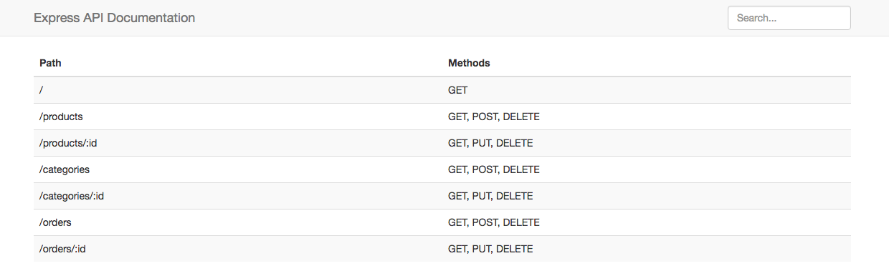

express-dox
===========

> A beautiful and simple express API documentation



## Install
```
$ npm install express-dox
```

## Usage
```js
var expressDox = require('express-dox');

// Use with express app, a single router or an array of routers
var source = app || router || [router1, router2];

// Register your own API documentation route
app.get('/api-doc', function(req, res) {
    expressDox(source, { title: 'Express API Documentation' }, function(doc) {
        res.status(200).send(doc);
    });
});
```
